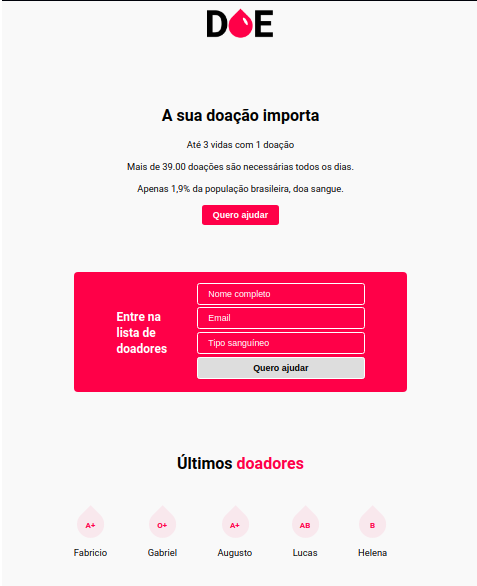

<p align="center">
  <a href="" rel="noopener">
 </a>
</p>

<h3 align="center">Front-end & Back-end da aplicação web "DOE" - Sistema de cadastro de doadores de sangue. </h3>

<div align="center">

[]()
[]()
[]()
[]()
[](/LICENSE)

</div>

---

## 📝 Conteúdo
<p align="center">
<a href="#about">Sobre</a>&nbsp;&nbsp;&nbsp;|&nbsp;&nbsp;&nbsp;
<a href="#installing">Instalando</a>&nbsp;&nbsp;&nbsp;|&nbsp;&nbsp;&nbsp;
<a href="#built_using">Tecnologias Utilizadas</a>&nbsp;&nbsp;&nbsp;|&nbsp;&nbsp;&nbsp;
<a href="#authors">Autor</a>
</p>


## 🧐 Sobre <a name = "about"></a>
<h3 align="center">Aplicação web "DOE" - Sistema de cadastro de doadores de sangue.</h3>
<p align="center">
  <a href="" rel="noopener">
 </a>
</p>

---

### 🛠 Instalando <a name = "installing"></a>

```
git clone https://github.com/fcsouza/doe-sangue-maratonadev.git
docker run --name database -e POSTGRES_PASSWORD=docker -p 5432:5432 -d postgres
Utilizar database.sql para criar tabela e atributos

yarn install || yarn
yarn start

http://127.0.0.1:3000/

```

## ⛏️ Tecnologias Utilizadas <a name = "built_using"></a>

- [HTML, CSS, JavaScript](https://www.w3schools.com/) - HTML, CSS, JavaScript 
- [Nunjucks](https://mozilla.github.io/nunjucks/) - A rich and powerful templating language for JavaScript. 
- [Express](https://expressjs.com/) - Server Framework
- [NodeJs](https://nodejs.org/en/) - Server Environment
- [Nodemon](https://www.npmjs.com/package/nodemon) - Simple monitor script for use during development
- [PostgreSQL](https://www.postgresql.org/) - Open source database(SGBD)

## ✍️ Autor <a name = "authors"></a>

- [@fcsouza](https://github.com/fcsouza)
